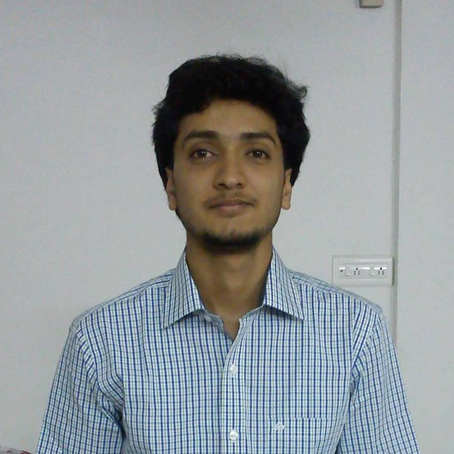

# A Fundamental Theory for Dexterous Surgical Skills Transfer to Medical Robots

Semi-autonomous teleoperation has been proposed as a solution for robotic assistance in austere environments. Nevertheless, having a remote teleoperator makes the system vulnerable to delays and cyber-attacks. The goal of the FORwARD project is to develop a semi-autonomous teleoperation framework that can effectively deal with delays. We propose a system where the surgeon performs a procedure in a realistic simulator uninterrupted. The actions of the surgeon are automatically recognized and sent as high level commands to the real robot, where these instructions are performed semi autonomously. Furthermore, we also propose a model for skill transfer between robots. This model is comprised of a robot agnostic framework with the ability of recognizing and performing surgical steps that have been learned in other domains. This framework significantly reduces the amount of visual and kinematic information that needs to be transmited for teleoperation, with minimal changes to the user experience of the surgeon. 

  

## DESK Dataset

We have createda a DESK (DExterous Surgical SKills) dataset which comprises a set of surgical robotic skills collected during a surgical training task using five robotic platforms: the Taurus II robot, the Taurus II simulated robot, the YuMi robot, the YuMi simulated robot, the da Vinci surgical robot. We conducted extensive experiments with three supervised learning models and provided baselines in each of these scenarios. Results show that using simulation data during training enhances the performance on the real robots, where limited real data is available.

The dataset can be accessed [here](https://purdue0-my.sharepoint.com/:f:/g/personal/gonza337_purdue_edu/EoSrFoOdZtNCp3vLGtY6TS4Bphq5hkNpd1gjeIyp6fosNA?e=16TOpq)

 

## Publications

- Madapana, N., Rahman, M. M., Sanchez-Tamayo, N., Balakuntala, M. V., Gonzalez, G., Bindu, J. P., ... & Voyles, R. M. (2019, November). DESK: A Robotic Activity Dataset for Dexterous Surgical Skills Transfer to Medical Robots. In 2019 IEEE/RSJ International Conference on Intelligent Robots and Systems (IROS) (pp. 6928-6934). IEEE.
- Rahman, M. M., Sanchez-Tamayo, N., Gonzalez, G., Agarwal, M., Aggarwal, V., Voyles, R. M., ... & Wachs, J. (2019, October). Transferring Dexterous Surgical Skill Knowledge between Robots for Semi-autonomous Teleoperation. In 2019 28th IEEE International Conference on Robot and Human Interactive Communication (RO-MAN) (pp. 1-6). IEEE.
- Gonzalez, G., Kaur, U., Rahman, M., Venkatesh, V., Sanchez, N., Hager, G., Xue, Y., Voyles, R., Wachs, J., From the DESK (Dexterous Surgical Skill) to the Battlefield - A Robotics Exploratory Study, Military Medicine (Accepted).

## Members
### Faulty

 |  
 Dr. Juan Wachs | Dr. Richard Voyles 
 |  
Dr. Vaneet Aggarwal | Dr. Yexiang Xue 

### Students

 |  | 
Glebys Gonzalez | Masudur Rahman | Mridul Agarwal
 |  
Mythra V. Balakuntala | Natalia Sanchez Tamayo
 
### Contact

For queries related to the project or dataset please contact Glebys Gonzalez (gonza337@purdue.edu)
