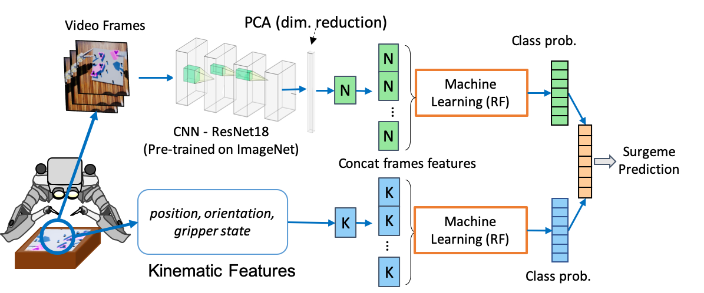
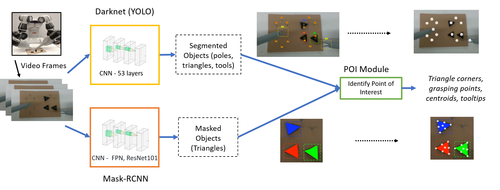

# Codes

Click on the headings below to get the respective source code.

## [Surgeme recogition baselines](https://forwardpurdue.github.io/codes)
The code for the surgeme recognition baselines on DESK dataset using Random forest and SVM.

  

## [Yumi simulator for RL](https://github.com/MythraV/gym_yumi)
A gym like environment designed for ABB Yumi Robot with surgical grippers.
The simulation is done in VREP with pyrep for communication and updating simulation parameters.

  

## [Object segmentation](https://github.com/MythraV/mrcnn-utils)
The Mask RCNN utilities for obtaining object segmentations and publishing the masks over ROS.

  

