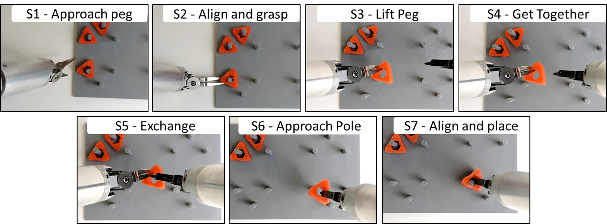

# Publications

## [DESK: A Robotic Activity Dataset for Dexterous Surgical Skills Transfer to Medical Robots](https://ieeexplore.ieee.org/document/8967760)

Madapana, N., Rahman, M. M., Sanchez-Tamayo, N., Balakuntala, M. V., Gonzalez, G., Bindu, J. P., Venkatesh V. L. N., Zhang X., Barragan-Noguera, J., Low, T. & Voyles, R. M. (2019, November). In 2019 IEEE/RSJ International Conference on Intelligent Robots and Systems (IROS) (pp. 6928-6934). IEEE.

  

# [Abstract]

Datasets are an essential component for training effective machine learning models. In particular, surgical robotic datasets have been key to many advances in semi-autonomous surgeries, skill assessment, and training. Simulated surgical environments can enhance the data collection process by making it faster, simpler and cheaper than real systems. In addition, combining data from multiple robotic domains can provide rich and diverse training data for transfer learning algorithms. In this paper, we present the DESK (DExterous Surgical SKills) dataset. It comprises a set of surgical robotic skills collected during a surgical training task using three robotic platforms: the Taurus II robot, Taurus II simulated robot, and the YuMi robot. This dataset was used to test the idea of transferring knowledge across different domains (e.g. from Taurus to YuMi robot) for a surgical gesture classification task with seven gestures/surgemes. We explored two different scenarios: 1) No transfer and 2) Domain transfer (simulated Taurus to real Taurus and YuMi robots). We conducted extensive experiments with three supervised learning models and provided baselines in each of these scenarios. Results show that using simulation data during training enhances the performance on the real robots, where limited real data is available. In particular, we obtained an accuracy of 55% on the real Taurus data using a model that is trained only on the simulator data, but that accuracy improved to 82% when the ratio of real to simulated data was increased to 0.18 in the training set.

